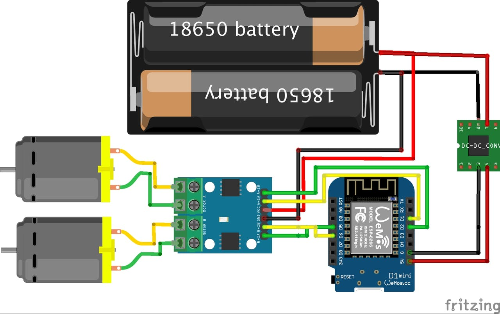
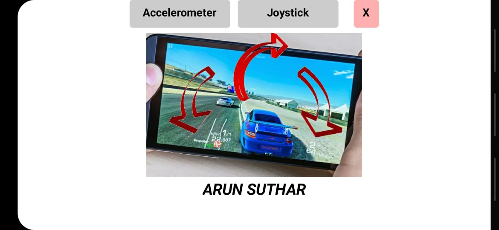

# gesture-controller-car
this is a 4 wheel robot with esp8266 micro controller and controlled with smart phone gesture using app

# component 

- es8266(i am using D1_mini)
- Moter drive(any)
- battery
- 4 wheel/4 motors
- 1 body

# schmetic

- 

# code
- [code for aurdino ide](arun_udp_car.ino)
this code for l298 motor driver and for relay based motor driver [relay_motor](motor.h) library is there.

# app

- this app made in mit app inverter and it is simple to make this app. hear we using UDP protocol for communication of esp8266 and smart phone.
- app is - 
- app look like 
- 

